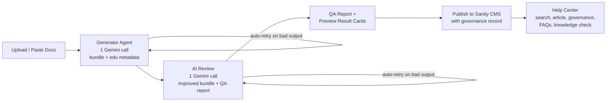

# KnowledgeOps AI

**AI-powered Customer Education Operations.** KnowledgeOps AI turns raw product documentation into governed, reviewable, publish-ready knowledge assets — a help article, FAQs, and an interactive knowledge check through an automated two-agent workflow, then publishes the reviewed asset to Sanity CMS, where it appears instantly in a public, searchable Help Center.

Built with **Next.js 16** (App Router + Server Actions), **Google Gemini**, and **Sanity CMS**, styled after the Harvey Legal Dark design system.

---

## Overview

Customer Education teams receive raw docs (Markdown, plain text) and must manually rewrite them into customer-facing learning content, run an editorial governance pass, and publish. KnowledgeOps AI automates that lifecycle end to end:

1. An operator **pastes documentation** or **uploads** a `.md`/`.txt` file.
2. The **Generator Agent** (one Gemini call) produces a structured knowledge asset — title, slug, summary, article, FAQs, knowledge check, and educational metadata (learning objectives, reading time, difficulty, target audience, prerequisites).
3. The **Review Agent** (one Gemini call, the "AI Review" step) editorially improves the entire asset and returns a **Quality Assurance Report** — overall quality score, readability assessment, itemized changes, and an explicit publishing recommendation — in the same response.
4. The operator judges publish-readiness from the QA report, previews the reviewed asset in result cards, and **publishes with one click**. The published document carries a **governance record** (review score, recommendation, generating model, review-agent version, documentation name, processing time, and last-reviewed date), then the operator is redirected to the Help Center where it appears immediately.
5. The **Help Center** reflects published content automatically — keyword search, article pages with learning objectives and a Content Governance panel, FAQs, and an interactive knowledge check.

A visual timeline animates each workflow stage as it completes, with per-stage timings, graceful error states, and **autonomous retries** at every AI step. The Home page opens with a **Knowledge Operations Dashboard** whose figures are computed live from Sanity, plus an architecture panel describing each stage.

---

## Features

- **Paste or upload** documentation (`.md`, `.txt`) through a single content-source abstraction.
- **Two-agent workflow** — exactly two AI calls per run (Generate → AI Review), efficient within free-tier limits; educational metadata and the QA report ride inside those same two calls.
- **Structured, validated output** — every AI response is parsed and validated against Zod schemas before use (governance at the schema level).
- **Autonomous, two-layer retries** — transient transport failures retry with exponential backoff inside the provider boundary; unusable model output (malformed JSON / schema-invalid content) is **re-prompted up to 3 times per agent** with no human intervention. A failure only surfaces if every attempt is exhausted.
- **Quality Assurance Report** — overall quality score (0–100), readability assessment, itemized changes (clarity, formatting, duplicates, quiz), and a Passed / Needs Attention recommendation.
- **Educational metadata** — learning objectives, reading time, difficulty, target audience, and prerequisites generated with every asset and shown in the workspace and Help Center.
- **Animated workflow timeline** — Uploaded → Generator Agent → AI Review → QA Report → Publishing → Knowledge Base Updated, with per-stage completion timings.
- **One-click publish** to the Sanity-backed knowledge base with success/error toasts and automatic redirect to the live Help Center.
- **Content Governance panel** on every article page — status, review score, review outcome, computed freshness, documentation version, generating and reviewing agents (with model), and the publish / last-reviewed / next-review-due dates.
- **Knowledge Operations Dashboard** — published articles, AI generations, AI reviews completed, average review score, average processing time, knowledge-base freshness, and last-published date, **all derived live from the article dataset** (no placeholder figures); publishing or deleting an article updates the dashboard automatically.
- **Public Help Center** — searchable content: article list with difficulty and reading-time hints, full article pages, FAQs, and an interactive knowledge check.
- **Embedded Sanity Studio** at `/studio` for managing published content in the same app.
- **Accessible, responsive UI** — labeled inputs, visible focus states, ARIA live regions, a screen-reader-friendly timeline, and mobile-first layouts.

---

## Architecture

The system is deliberately small and seam-oriented.

- **Two-agent pipeline.** The Generator Agent produces the full content bundle (including educational metadata) in one structured-JSON request; the Review Agent improves the whole bundle and produces the QA Report in a second request. No per-artifact calls — the QA Report timeline stage presents data the reviewer already returned.
- **One AI abstraction (provider-swap boundary).** All model access goes through `generateWithGemini` in [`lib/ai/gemini.ts`](lib/ai/gemini.ts). It owns client initialization, model config, structured-JSON generation, JSON parsing, transient-failure retries with backoff, rate-limit handling, and typed error results. Agents know nothing about the provider — swapping Gemini for Claude or OpenAI touches one module.
- **Layered resilience.** Transport errors (network / 429 / 5xx) retry inside the provider boundary; *semantic* failures (the model replied, but the output is unusable) are re-prompted at the **agent** layer ([`actions/generate-content.ts`](actions/generate-content.ts), [`actions/review-content.ts`](actions/review-content.ts)). The two layers compose without double-retrying — a transport error never triggers a re-prompt on top of the backoff it already ran.
- **Actions layer.** Next.js server actions (`actions/`) are the only bridge between UI and services: `generate-content`, `review-content`, `publish-to-sanity`, `fetch-articles`, `fetch-stats`. Each returns a typed discriminated-union result and never throws raw errors into the UI.
- **Derived, not stored, dashboard.** Knowledge Ops figures are pure functions of the published article dataset ([`lib/education/stats.ts`](lib/education/stats.ts)), recomputed on each request — so the dashboard can never drift from reality.
- **Content-source abstraction.** [`lib/content-source`](lib/content-source/index.ts) normalizes every input (pasted text, uploaded file) to one trimmed documentation string. New formats (e.g. PDF) are added by registering a `FileContentExtractor` — the upload flow doesn't change.
- **Seam-based testing.** Tests inject fakes at the seams instead of mocking SDKs: `setModelCaller` / `setRetryDelays` replace the Gemini transport, and `setSanityWriter` / `setSanityReader` replace the Sanity client. The suite exercises real parsing, validation, retry, and error-mapping logic with **no network access**.

### Workflow



```
Upload → Generator Agent → AI Review → QA Report → Publish to Sanity → Help Center
```

---

## Folder Structure

```
learnopsai/
├── app/                          # Next.js App Router
│   ├── page.tsx                  # Home: Knowledge Ops dashboard + pipeline workspace
│   ├── help-center/              # Public Help Center (list + [slug] article page)
│   └── studio/                   # Embedded Sanity Studio (/studio)
├── actions/                      # Server actions (UI ↔ services bridge)
│   ├── generate-content.ts       # Generator Agent (+ autonomous retry)
│   ├── review-content.ts         # Review Agent — bundle + QA report (+ autonomous retry)
│   ├── publish-to-sanity.ts      # Persist reviewed bundle + governance record
│   ├── fetch-articles.ts         # GROQ reads for the Help Center
│   └── fetch-stats.ts            # Knowledge Operations Dashboard figures
├── components/
│   ├── agents/                   # Timeline, QA report card, result cards, publish card
│   ├── dashboard/                # Knowledge Ops dashboard + architecture panel
│   ├── education/                # Difficulty badge, reading-time label
│   ├── help-center/              # Search, article body, governance sidebar, FAQ + quiz
│   ├── layout/                   # Dashboard shell (nav, skip link)
│   ├── upload/                   # Documentation form (paste / upload tabs)
│   └── ui/                       # UI primitives (base-ui)
├── hooks/
│   └── use-content-generation.ts # Client pipeline state machine + stage timings
├── lib/
│   ├── ai/                       # Gemini abstraction, prompts, Zod schemas (provider-swap boundary)
│   ├── content-source/           # Paste/file input normalization (extension point)
│   ├── education/                # Pure derivations: freshness, doc fingerprint & name,
│   │                             #   governance metadata, Knowledge Ops stats
│   ├── sanity/                   # Sanity client factory (read/write seams) + types
│   └── types/                    # Shared domain types
├── sanity/                       # Sanity schema (helpArticle) shared with the Studio
├── tests/                        # Vitest suites (seam-injected fakes, no network)
├── utils/                        # Small pure helpers (slug, date, env, article parsing)
├── sanity.config.ts              # Embedded Studio config
├── sanity.cli.ts                 # Sanity CLI config (schema deploy, etc.)
└── harvey.ai-design.md           # Design-system source of truth
```

---

## Tech Stack

- **Next.js 16** (App Router, Server Actions) + **React 19** + **TypeScript** (strict)
- **Tailwind CSS v4** + **base-ui** primitives — Harvey Legal Dark theme
- **Google Gemini** (`gemini-2.5-flash`) via `@google/genai`
- **Sanity CMS** via `@sanity/client` / `next-sanity` + GROQ, with an embedded Studio
- **React Hook Form** + **Zod** for forms and AI-output validation
- **Vitest** for the test suite
- **sonner** for toasts, **lucide-react** for icons

---

## Getting Started

### 1. Install

```bash
pnpm install
```

### 2. Environment variables

```bash
cp .env.example .env.local
```

Fill in the values (see the [table below](#environment-variables)):

- `GEMINI_API_KEY` — create one at [Google AI Studio](https://aistudio.google.com/apikey).
- Sanity variables — see the next step.

### 3. Create the Sanity project

1. Sign up / log in at [sanity.io/manage](https://www.sanity.io/manage) and create a project with a `production` dataset.
2. Copy the **project ID** into `NEXT_PUBLIC_SANITY_PROJECT_ID` and set `NEXT_PUBLIC_SANITY_DATASET=production`.
3. Create an API token with **Editor** permissions (Project → API → Tokens) and set it as `SANITY_API_TOKEN` (server-side only).
4. The document schema (`helpArticle`) lives in [`sanity/schemas/help-article.ts`](sanity/schemas/help-article.ts) and is served by the **embedded Studio at `/studio`** — no separate Studio project is required. Documents published before the educational-metadata and governance fields existed still render; those fields are optional on read.

### 4. Run

```bash
pnpm dev          # start the app at http://localhost:3000  (Studio at /studio)
pnpm test         # run the Vitest suite
pnpm lint         # ESLint
pnpm build        # production build
```

---

## Environment Variables

| Variable                        | Required             | Description                                                                 |
| ------------------------------- | -------------------- | --------------------------------------------------------------------------- |
| `GEMINI_API_KEY`                | Yes                  | Google Gemini API key used by both agents (server-side only).               |
| `NEXT_PUBLIC_SANITY_PROJECT_ID` | Yes                  | Sanity project ID for reads and writes.                                     |
| `NEXT_PUBLIC_SANITY_DATASET`    | Yes                  | Sanity dataset name (default `production`).                                 |
| `SANITY_API_TOKEN`              | Yes (for publishing) | Server-side write token with Editor role. **Never** expose with `NEXT_PUBLIC_`. |

Missing configuration is detected at first use and surfaced as a clear, human-readable error instead of a crash.

---

## Content Governance

Every published asset carries a governance record, surfaced on its article page:

| Field | Source |
| --- | --- |
| **Status** | Always `Published` (with a success indicator) |
| **Review Score** | Review Agent's `overallQualityScore` (e.g. `96 / 100`) |
| **Review Outcome** | `Passed Quality Review` / `Needs Attention` from the recommendation |
| **Content Freshness** | Computed from the publish/review date (e.g. `Healthy (100%)`) with linear decay |
| **Documentation Version** | The source Markdown's own name (its `# H1`) plus a version, e.g. `Matter Search v1` |
| **Generated By** | Generator Agent · *Powered by Gemini 2.5 Flash* |
| **Reviewed By** | AI Quality Reviewer · *Powered by Gemini 2.5 Flash* |
| **Published / Last Reviewed** | Stamped at publish time |
| **Next Review Due** | Last-reviewed date + 90-day review cadence |

---

## Testing

The Vitest suite runs entirely offline by injecting fakes at the service seams — no Gemini or Sanity network calls. It covers the agents (including the autonomous-retry paths), publishing and governance mapping, the Knowledge Ops derivations, freshness/documentation-name/fingerprint helpers, and Help Center reads.

```bash
pnpm test
```

---

## Future Improvements

- **Claude / OpenAI support** — the `generateWithGemini` boundary makes adding providers a one-module change.
- **Multi-agent orchestration** — specialized agents (structure, tone, fact-check) over the same bundle contract.
- **ElevenLabs narration** — audio versions of published articles.
- **Skilljar LMS integration** — push quizzes and articles into formal course flows.
- **Content-freshness monitoring** — flag published articles whose source documentation has changed.
- **Scheduled review agents** — periodic re-review of the live catalog for accuracy and tone drift.
- **Semantic search** — embedding-based Help Center search beyond keyword matching.
- **Analytics dashboard** — article views, search misses, quiz pass rates.
- **Human approval workflows** — multi-reviewer sign-off gates between review and publish.
```
